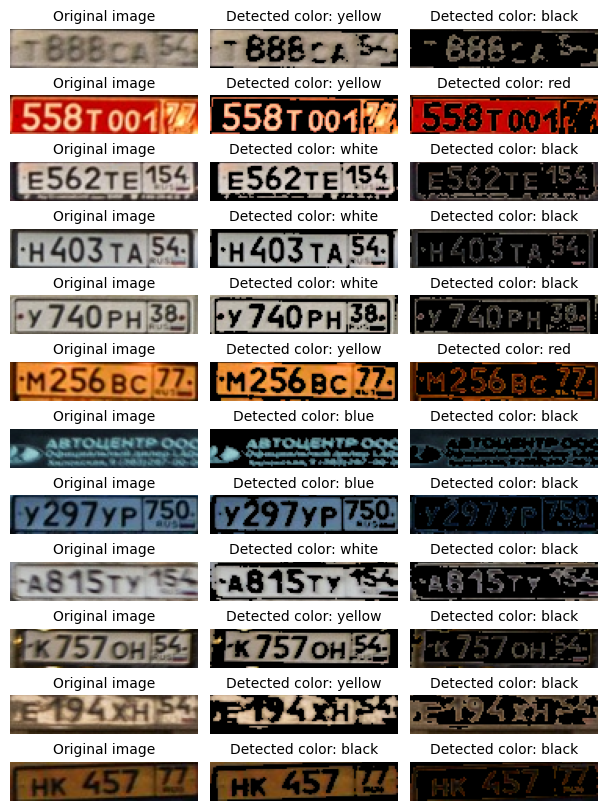

## Описание решения


# Pipeline

# Структура проекта

Мое решение состоит из трех основных частей:
1. **Детектор** - выделение ограничивающей рамки на заданном изображении
2. **Трансформация** - трансформация выделенного номера автомобиля с целью повышения точности распознавания номера
3. **Распознавание номера**

Для всех частей реализован базовый интерфейс. При этом каждая часть независима от другой. Окончательный пайплайн состоит из последовательного выполенения каждого этапа.

```
.
├── data
├── README.md
├── requirements.txt        <- Файл, в котором представлены зависимости
├── weights                 <- Папка для весов моделей
├── src
│   ├── inference.py        <- Реализация итогового пайплайна
│   ├── models
│   │   ├── detection       <- Реализация выделения номеров
│   │   ├── transform       <- Реализация трансформации номера
│   │   └── ocr             <- Реализация выделения текста
│   ├── utils
└── tutorial.ipynb          <- Ноутбук с примером работы
```

# Использование

Чтобы продемонстрировать результаты работы, вы можете использовать файл [tutorial.ipynb](./tutorial.ipynb). Перед его использованием необходимо установить зависимости проекта:
```
pip install -r requirements.txt 
```

После установки зависимостей вам необходимо находясь в **корневой папке** репозитория запускать команды:
```
# Linux command
chmod +x load_data.sh
./load_data.sh
```

# Определение типа автономера
На мой взгляд, определять тип автономера можно двумя способами:
1. На основе полученного после OCR-этапа текста. Каждый тип российского номера имеет свой формат записи, опираясь на него можно однозначно идентифицировать тип. В данном решение это не было сделано ввиду того, что используемая модель EasyOCR не была обучена на различных форматах, ввиду это плохо распознает нестандартные номера. 
2. Обучать дополнительно классификатор на этапе выделения объектов.

Отдельно стоит отметить, что классифицировать рамку исходя только из изображения (без опоры на результат OCR) достаточно трудная задача. Эксперимент с номерами представлен в ноутбуке [color_classification.ipynb](./color_classification.ipynb). Основная задача состояла в определении основного цвета номера и фона. Для разделения использовался метод Оцу. Для сравнения изображения были переведены в LAB палитру и далее высчитывалась CIE2000 метрика между изображение и основным набором цветов (белый, черный, красный, голубой, желтый). По полученной метрике определялся цвет. Результаты работы представлены ниже:  


# Потенциальные улучшения
1. В данный момент используются веса, которые обучены только на российские номера. Следующим шагом может стать расширение выборки.
2. Для уточнения точности решения можно добавить проверку итогового результата с помощью регулярных выражений.
3. Для повышения качества на нестандартных номерах можно сгенерировать синтетический набор данных на базе существующего. 

# Ссылки: 
1. [Выделение автомобильного номера](https://github.com/In48semenov/Car-numbers)
2. [License Plate Detection Pytorch](https://github.com/xuexingyu24/License_Plate_Detection_Pytorch)
3. [YOLO V5](https://github.com/ultralytics/yolov5)
